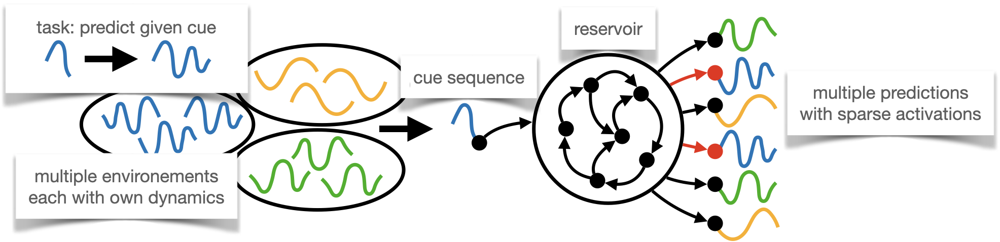

# Continual Learning of Dynamical Systems with Competitive Multi-Head Reservoirs 

This repository contains the code for our paper [Continual Learning of Dynamical Systems with Competitive Multi-Head Reservoirs]() 

## Abstract
Machine learning recently proved efficient in learning differential equations and dynamical systems from data. 
However, the data is commonly assumed to originate from a single never-changing system. 
In contrast, when modeling real-world dynamical processes, the data distribution often shifts due to changes in the underlying system dynamics. 
Continual learning of these processes aims to rapidly adapt to abrupt system changes without forgetting previous dynamical regimes. 
This work proposes an approach to continual learning based on reservoir computing, a state-of-the-art method for training recurrent neural networks on complex spatiotemporal dynamical systems. 
Reservoir computing fixes the recurrent network weights - hence these cannot be forgotten - and only updates linear projection *heads* to the output.
We propose to train multiple competitive prediction heads concurrently. Inspired by neuroscience's predictive coding, only the most predictive heads activate, laterally inhibiting and thus protecting the inactive heads from forgetting induced by interfering parameter updates.
We show that this multi-head reservoir minimizes interference and catastrophic forgetting on several dynamical systems, including the Van-der-Pol oscillator, the chaotic Lorenz attractor, and the high-dimensional Lorenz-96 weather model. Our results suggest that reservoir computing is a promising candidate framework for the continual learning of dynamical systems.

## Citing
If you find this code useful for your research, please consider citing our paper:

> Leonard Bereska and Efstratios Gavves. "Continual Learning of Dynamical Systems with Competitive Multi-Head Reservoirs." CoLLAs, 2022.

## Contact 
For any inquiries, please contact: <leonard.bereska@uva.nl>